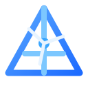

<p align="center">
  
</p>

<h1 align="center">BeiFeng — Wind Turbine O&amp;M Agent</h1>

<p align="center">
  <b>风力发电运维智能体</b> — A Rust-powered AI agent for wind farm operations &amp; maintenance, built on a Claw Code–style runtime with a RAG knowledge hub, fault diagnosis, risk assessment and report generation.
</p>

<p align="center">
  <a href="#features">Features</a> ·
  <a href="#architecture">Architecture</a> ·
  <a href="#quick-start">Quick Start</a> ·
  <a href="#usage">Usage</a> ·
  <a href="#safety">Safety</a> ·
  <a href="#license">License</a>
</p>

<p align="center">
  
  
  
  
  
</p>

---

BeiFeng is a specialized **wind turbine operations &amp; maintenance (O&amp;M) agent**. It adapts a Claw Code–style agent runtime (Rust) to the wind-farm domain: a local RAG "Wind Knowledge Hub" built from fault cases, inspection manuals and regulations; a lightweight fault graph; rule-based diagnosis and risk assessment; Markdown inspection-report generation; and a Tauri desktop workstation that ties it all together — with safety boundaries enforced at the prompt, rule, and tool level.

> ⚠️ **Domain safety notice**: this project is designed as an *assistant* for qualified wind-farm engineers. It never executes or recommends high-risk remote operations (shutdown, reset, pitch/yaw override, interlock bypass) without human confirmation. See [Safety](#safety).

## Features

- 🤖 **Specialized O&amp;M agent** — wind-domain system prompt, structured answer format (判断 → 原因 → 排查 → 建议 → 安全风险 → 补充数据)
- 🧠 **Wind Knowledge Hub (RAG)** — hybrid retrieval (vector + keyword + metadata) over fault cases, manuals, inspection reports and regulations
- 🕸️ **Fault graph** — lightweight component–symptom–cause graph with risk levels (`beifeng/knowledge/knowledge_graph/wind_fault_graph.json`)
- 🛡️ **Rule-based safety layer** — forbidden actions, human-confirmation gates, safety-compliance evaluation
- 📄 **Report generation** — templated Markdown inspection/maintenance reports under `beifeng/reports/generated/`
- 🧪 **Benchmark harness** — 100-query, 10-category evaluation pipeline with regression baselines (**99.3% overall**)
- 🖥️ **Tauri desktop workstation** — workspace/file management, settings editor, memory timeline, reports browser, system monitor, agent console (React + TypeScript)
- ⚙️ **Provider-agnostic runtime** — Anthropic &amp; OpenAI-compatible endpoints (DeepSeek, Qwen, etc.), streaming, tool-use, sessions, permissions, MCP, plugins
- 🧩 **Extensible connectors** — schemas for SCADA / CMMS / weather / UAV data sources

## Architecture

```text
┌────────────────────────────────────────────────────────────────┐
│                     apps/desktop (Tauri 2)                     │
│   React + TypeScript — workspace, settings, reports, monitor   │
└──────────────────────────────┬─────────────────────────────────┘
                               │ local HTTP / process
┌──────────────────────────────▼─────────────────────────────────┐
│                     rust/  (Cargo workspace)                   │
│  ┌─────────────┐  ┌──────────────────────┐  ┌───────────────┐  │
│  │  api        │  │ claw-rag-service     │  │ runtime       │  │
│  │  providers  │  │  Wind Knowledge Hub  │  │  session ·    │  │
│  │  streaming  │  │  ingest · hybrid     │  │  permission · │  │
│  │             │  │  search · fault      │  │  MCP · tools  │  │
│  │             │  │  graph · advice ·    │  │               │  │
│  │             │  │  risk · reports      │  │               │  │
│  └─────────────┘  └──────────────────────┘  └───────────────┘  │
│  ┌─────────────┐  ┌──────────────────────┐  ┌───────────────┐  │
│  │ rusty-claude│  │ tools · commands     │  │ plugins ·     │  │
│  │ -cli (claw) │  │ agents · telemetry   │  │ telemetry     │  │
│  └─────────────┘  └──────────────────────┘  └───────────────┘  │
└──────────────────────────────┬─────────────────────────────────┘
                               │
┌──────────────────────────────▼─────────────────────────────────┐
│                  beifeng/  (domain assets)                     │
│  knowledge/ (KB + fault graph) · skills/ · prompts/            │
│  config/ · evals/ (benchmarks) · connectors/ · reports/        │
└────────────────────────────────────────────────────────────────┘
```

| Layer | Crates / dirs | Responsibility |
|---|---|---|
| **Runtime** | `rust/crates/runtime`, `api`, `tools`, `commands`, `plugins`, `telemetry`, `rusty-claude-cli` | Agent loop, provider clients (Anthropic / OpenAI-compatible), tool execution, sessions, permissions, MCP, slash commands |
| **Domain** | `rust/crates/claw-rag-service` | Wind Knowledge Hub: ingestion, hybrid search, fault graph, advice, risk, report generation |
| **Assets** | `beifeng/` | Knowledge base, fault graph, skills, prompts, connectors, config, evaluations |
| **Desktop** | `apps/desktop/` | Tauri 2 workstation for local-first workflows |

## Quick Start

### Prerequisites

- Rust 1.75+ (edition 2021 workspace)
- Python 3.10+ (evaluation pipeline only)
- Node.js 18+ (desktop app only)

### 1. Configure

```powershell
Copy-Item .env.example .env
# edit .env — point at any OpenAI/DeepSeek-compatible endpoint
$env:DEEPSEEK_API_KEY = "your-key-here"
```

`beifeng/config/settings.json` controls the agent name, model, endpoints and safety rules; local secrets can optionally live in a gitignored `beifeng/config/secrets.json`. The default config expects a DeepSeek-compatible gateway via `DEEPSEEK_BASE_URL` + `DEEPSEEK_API_KEY`.

### 2. Build the Rust workspace

```powershell
cd rust
cargo build --release
```

### 3. Ingest the knowledge base

```powershell
cd ..
cargo run --manifest-path rust/Cargo.toml -p claw-rag-service -- ingest `
  --knowledge-base beifeng/knowledge/knowledge_base `
  --db beifeng/data/wind.sqlite
```

### 4. Serve the RAG service (terminal 1)

```powershell
cargo run --manifest-path rust/Cargo.toml -p claw-rag-service -- serve `
  --db beifeng/data/wind.sqlite
```

### 5. Run the agent

```powershell
cargo run --manifest-path rust/Cargo.toml -p rusty-claude-cli -- `
  --model <your-model-alias>
```

Or use the PowerShell workflow helpers:

```powershell
.\scripts\build.ps1      # build + configure
.\scripts\ingest.ps1     # ingest knowledge base
.\scripts\serve_rag.ps1  # start RAG service
.\scripts\run_agent.ps1  # start agent REPL
```

### Desktop app (optional)

```powershell
cd apps/desktop
npm install
npm run tauri:dev
```

## Usage

### Agent REPL

```bash
cargo run -p rusty-claude-cli -- prompt "叶片前缘发现裂纹，需要怎么处理？"
```

The agent answers with the standard wind-O&amp;M structure: 问题判断 → 可能原因 → 排查步骤 → 维修建议 → 安全风险 → 需要补充的数据.

### Report generation

```powershell
cargo run --manifest-path rust/Cargo.toml -p claw-rag-service -- report-generate `
  --db beifeng/data/wind.sqlite `
  --graph beifeng/knowledge/knowledge_graph/wind_fault_graph.json `
  --problem "叶片裂纹" `
  --component Blade `
  --symptom "裂纹" `
  --report-type inspection_report
```

### Evaluation / benchmark

```powershell
python beifeng/evals/run_benchmark.py
python beifeng/evals/eval_pipeline.py
```

Current baseline: **99.3% overall** (604/608) across 100 queries and 10 categories (component inference, graph matching, RAG recall, risk assessment, advice consistency, report generation, safety compliance, multi-component, historical context, SCADA-derived).

## Repository layout

```text
beifeng/            Wind O&M domain assets
  config/           agent + path settings (schema included)
  knowledge/        knowledge_base docs, fault graph
  prompts/          domain system prompt
  skills/           blade inspection, gearbox diagnosis, SCADA analysis, ...
  workflows/        documented O&M workflows
  evals/            benchmark harness + baselines
  connectors/       SCADA / CMMS / weather / UAV schemas
  memory/           reserved runtime-memory schemas (populated locally)
  reports/          generated reports + templates
rust/
  crates/           11 crates — runtime, api, tools, claw-rag-service, ...
scripts/            PowerShell workflow helpers
apps/desktop/       Tauri 2 desktop workstation
docs/               additional documentation
```

## Safety

Wind-farm operations are high-risk environments. BeiFeng enforces conservative boundaries:

- **Forbidden actions** (prompt + rule layer): unauthorized remote shutdown / reset, interlock bypass, replacing field-engineer judgment.
- **Human confirmation** required for all high-voltage, lifting, grid-connection, pitch, reset and shutdown related actions.
- The agent **never invents** standards, fault codes, or equipment parameters — it answers from the curated knowledge base.
- High-risk answers always surface a "safety risk" section and ask for missing data before advising.

Contributors must keep these boundaries intact — see the PR checklist.

## License

[MIT](LICENSE)
