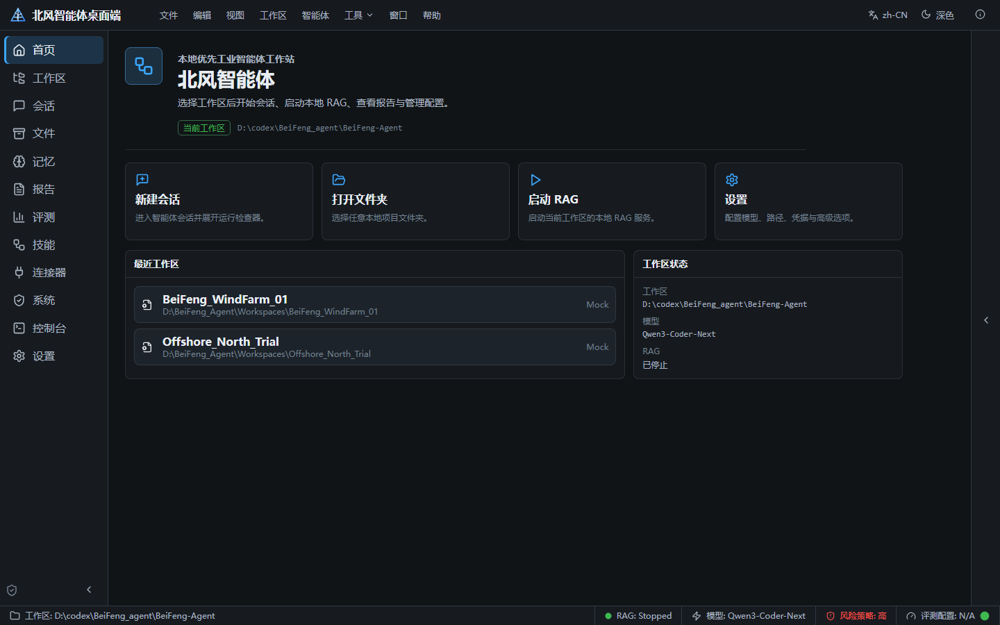
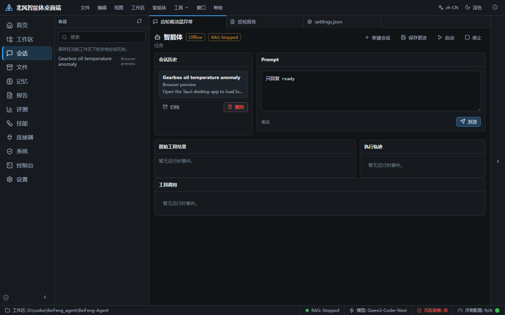
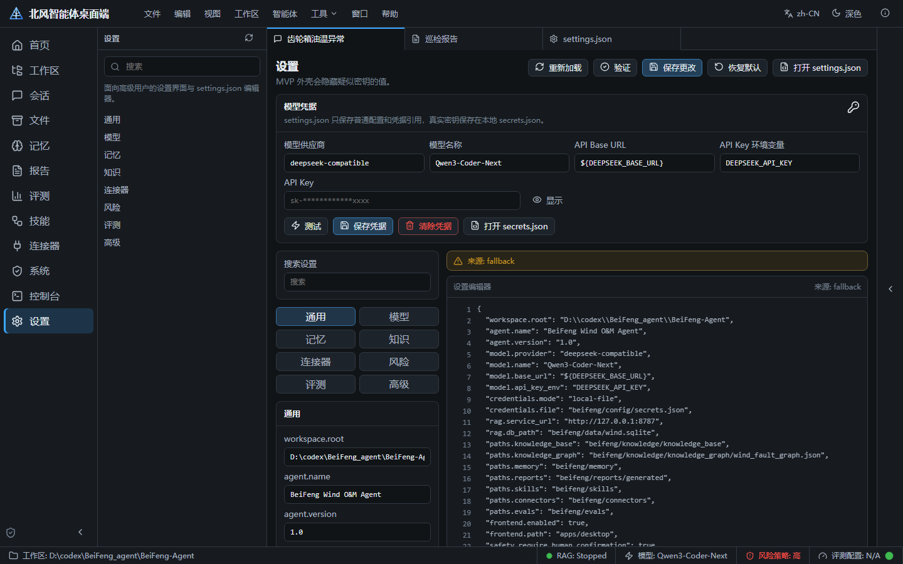
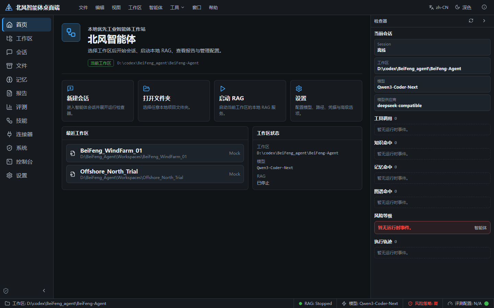
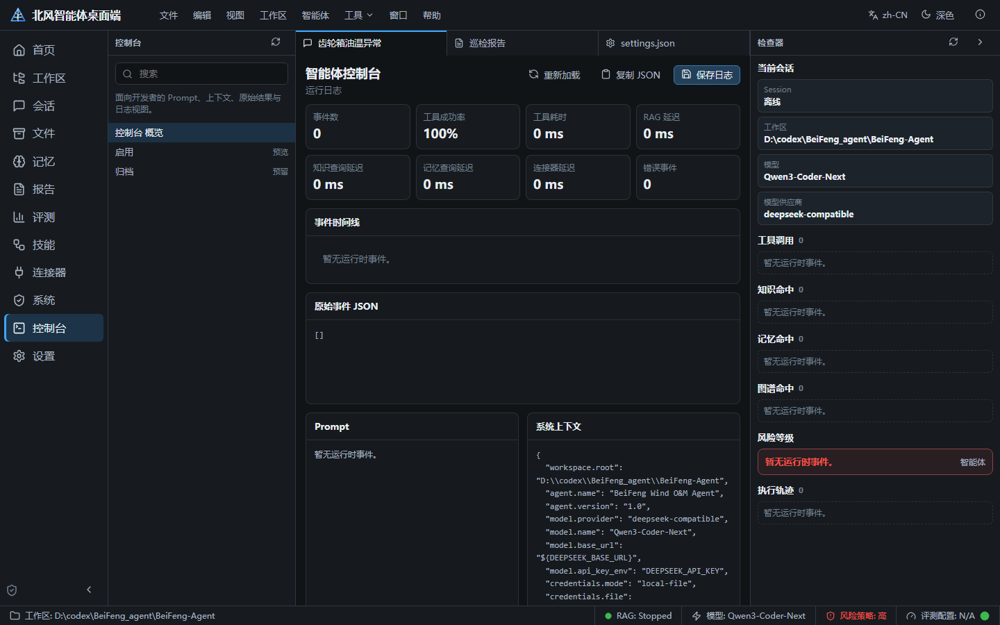
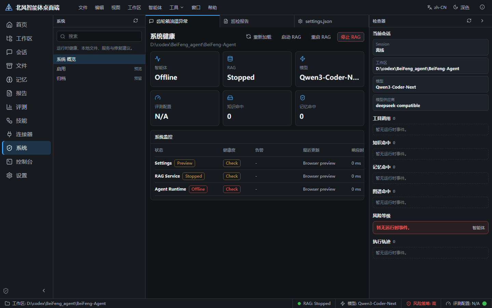
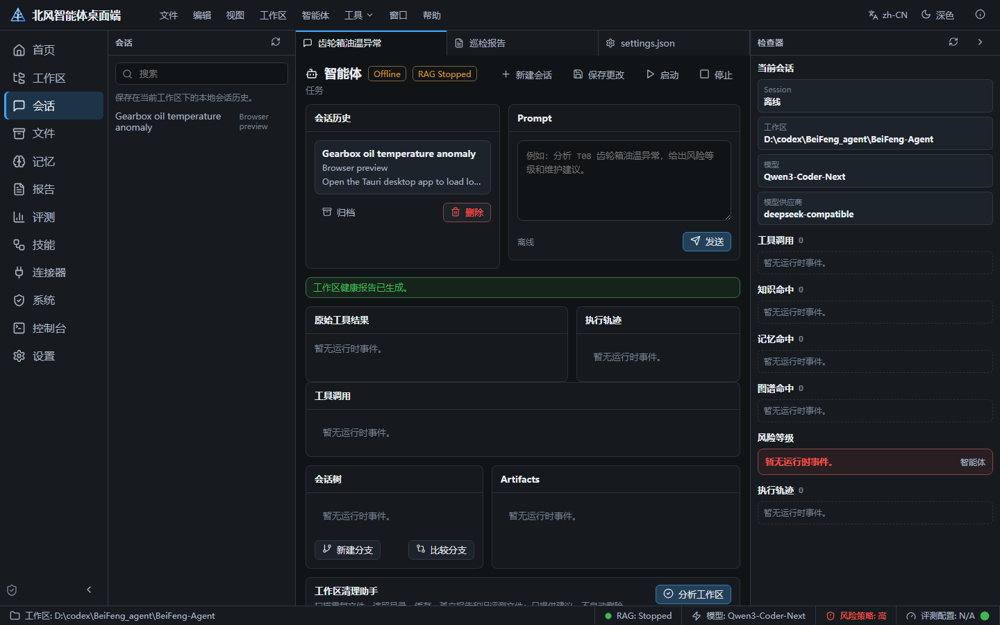
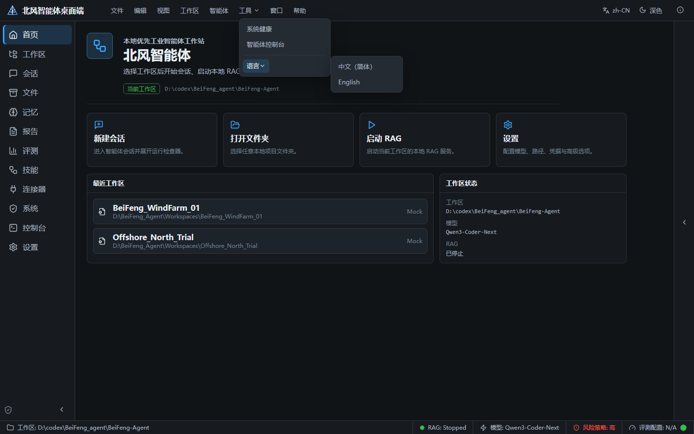
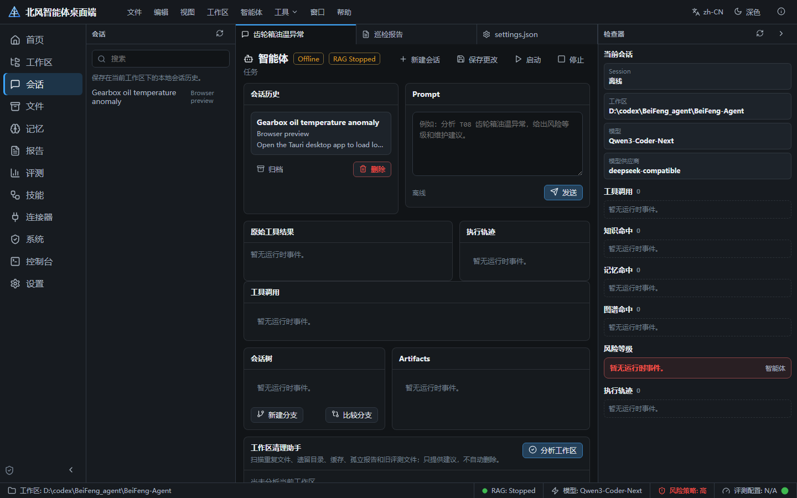

# BeiFeng Agent Desktop

A Tauri 2 + React + TypeScript desktop workstation for local-first BeiFeng Agent workflows.
It controls local workspace files, settings, reports, memory, benchmark outputs, runtime launchers,
and product navigation without modifying Agent intelligence or backend evaluation logic.

<p align="center">
  
</p>

## Screenshot Tour

### Chat with the agent

<table>
<tr>
<td width="55%">

- Continuous conversation with Markdown rendering
- Tool calls shown as collapsible cards
- Conversation history sidebar

</td>
<td width="45%">
  
</td>
</tr>
</table>

### Settings &amp; credentials

<table>
<tr>
<td width="45%">
  
</td>
<td width="55%">

- Categorized settings with search and JSON editor
- Credential manager with show/hide
- One-click RAG service control

</td>
</tr>
</table>

### Live inspector

<table>
<tr>
<td width="55%">

- Real-time tool calls, knowledge hits, graph hits and risk assessment
- Execution trace driven by the runtime `AgentEvent` stream

</td>
<td width="45%">
  
</td>
</tr>
</table>

### Agent console

<table>
<tr>
<td width="45%">
  
</td>
<td width="55%">

- Event timeline with tool duration and success rate
- Raw event JSON with secret redaction

</td>
</tr>
</table>

### System monitor

<table>
<tr>
<td width="55%">

- Runtime, RAG and memory health at a glance
- Benchmark, settings and API key environment status

</td>
<td width="45%">
  
</td>
</tr>
</table>

### Workspace health report

<table>
<tr>
<td width="45%">
  
</td>
<td width="55%">

- Health dashboard across runtime, RAG, memory, knowledge and graph
- Duplicate / legacy file cleanup recommendations

</td>
</tr>
</table>

<details>
<summary>More screenshots</summary>

| Tools &amp; language | Conversation tree &amp; artifacts |
| --- | --- |
|  |  |

</details>

## Highlights

- **Workspaces** — create, open, import, switch, archive, remove, persist, and recent list.
- **File &amp; IDE integration** — Windows Explorer reveal, VSCode launch, refresh, rename, and user-facing errors.
- **Settings** — categories, search, JSON editor, validate, save, reload, reset defaults, and open in VSCode.
- **Reports** — search, type filter, date ordering, Markdown preview, metadata panel, copy/export Markdown, reveal, and VSCode open.
- **Memory timeline** — turbine, fault type, and risk filters plus report navigation.
- **System Monitor &amp; Health Dashboard** — runtime, RAG, memory, knowledge, graph, reports, connectors, benchmark, settings, and API key environment.
- **Agent Console** — redacted context, raw output, tool calls, and debug log save.
- **Runtime events** — a unified `AgentEvent` stream powers the Live Inspector and Console (see `docs/runtime-event-schema.md`).
- **i18n** — `zh-CN` default with persisted language preference and `en-US`.

## Pages

| Page | Purpose |
| --- | --- |
| `HomePage` | Startup landing and product navigation |
| `ChatPage` | Agent conversation with tool-call cards and Markdown |
| `WorkspacePage` | Workspace lifecycle and file explorer |
| `FilesPage` | Workspace / knowledge / memory / reports browsing |
| `SettingsPage` | Settings + credentials + RAG service control |
| `ReportsPage` | Generated report browsing and preview |
| `MemoryPage` | Memory timeline and filters |
| `BenchmarkPage` | Benchmark reports and key scores |
| `SkillsPage` | Project skill specifications |
| `ConnectorsPage` | Reserved SCADA / UAV connector surfaces |
| `SystemPage` | System monitor and health dashboard |
| `AgentConsolePage` | Runtime event timeline and debug logs |

## Commands

```powershell
npm install
npm run dev           # browser-only UI (safe fallback data)
npm run build
npm run tauri:dev     # full Tauri shell
cd src-tauri
cargo check
```

## Key Tauri Commands

- **Workspace**: `create_workspace`, `select_workspace_folder`, `import_workspace_folder`, `get_current_workspace`, `set_current_workspace`, `list_recent_workspaces`, `archive_workspace`, `remove_workspace_from_list`
- **Language**: `get_language_preference`, `set_language_preference`
- **Files &amp; IDE**: `list_workspace_files`, `open_file`, `rename_path`, `reveal_in_explorer`, `open_in_vscode`
- **Settings**: `read_settings_json`, `write_settings_json`, `validate_settings_json`, `reset_settings_json`, `open_settings_json_in_vscode`
- **Reports**: `list_reports`, `read_report`, `read_report_detail`, `export_report_markdown`, `reveal_report`, `open_report_in_vscode`
- **Memory**: `read_turbine_profiles`, `read_fault_history`, `read_maintenance_history`, `read_report_history`, `read_memory_payload`
- **Benchmark**: `list_benchmark_reports`, `read_latest_benchmark_report`, `parse_key_scores`
- **Runtime**: `start_agent_session`, `stop_agent_session`, `send_agent_prompt`, `stream_agent_output`, `get_agent_status`, `start_rag_service`, `stop_rag_service`, `restart_rag_service`, `get_rag_health`
- **Product surfaces**: `get_runtime_inspector`, `get_system_monitor`, `get_health_dashboard`, `get_agent_console`, `save_debug_log`

## Runtime Event Protocol

The desktop consumes `AgentEvent` objects as the source of truth for the Inspector and Console.
It no longer parses natural-language CLI text to infer tools, RAG hits, graph hits, or risk.
See `docs/runtime-event-schema.md` for the full event type list and desktop rules.

## Notes

- Browser dev mode uses safe fallback data for local file APIs.
- Run `npm run tauri:dev` to exercise folder dialogs, file operations, VSCode launchers, and Explorer reveal actions.
- Agent prompt execution uses local `claw.exe` when available and reads model/base URL/API key environment names from `beifeng/config/settings.json`.
- API keys are never hardcoded by the desktop app; secrets are loaded from `beifeng/config/secrets.json` and redacted before logs or raw event JSON are exposed.
