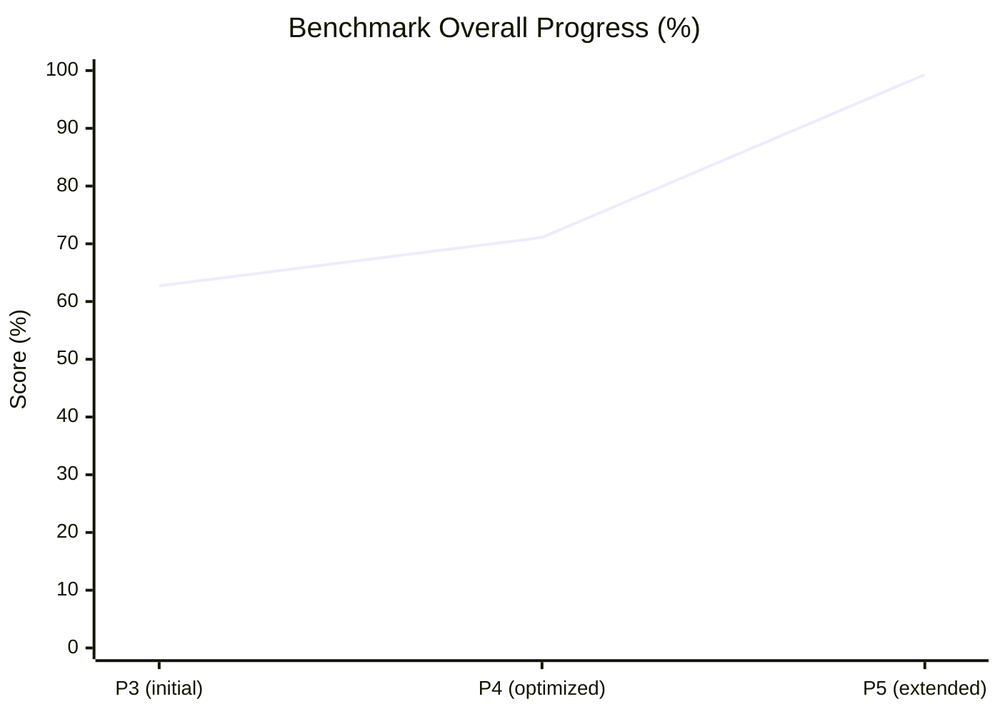
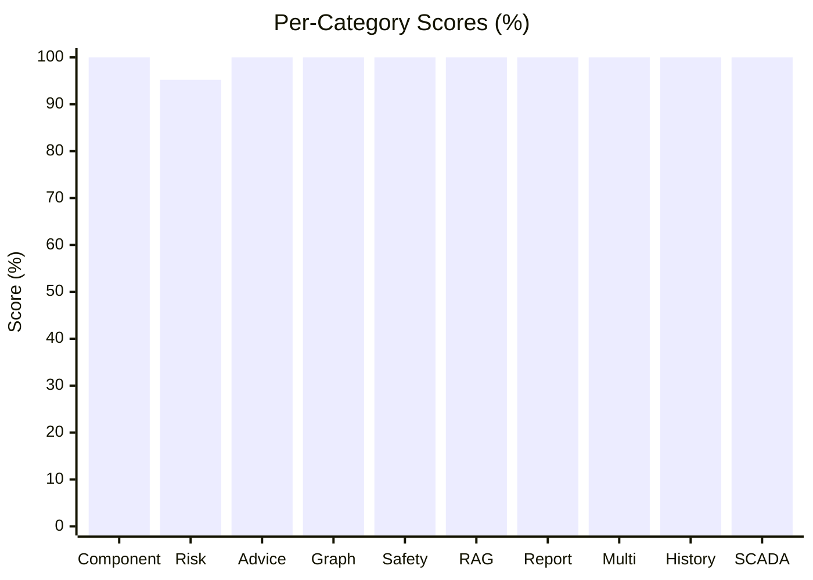

# BeiFeng Benchmark 成果报告

<p align="center">
  
  
  
  
</p>

## TL;DR

通过三个阶段的持续优化（组件映射补全 → 关键词与风险校准 → 评估集扩展与维度对齐），Benchmark 总分从 **62.7% 提升至 99.3%**（604 / 608），**10 个评估维度中 9 个达到 100%**，仅风险等级评估（risk_assessment）留有 4 分可优化空间。



## 关键数字

| 指标 | 数值 |
| --- | --- |
| 评估查询数 | 100 条 |
| 评估维度数 | 10 类 |
| 总分 | **604 / 608（99.3%）** |
| 满分维度 | 9 / 10 |
| 唯一扣分维度 | risk_assessment（79 / 83，95.2%） |

## 当前成绩明细

| 维度 | 得分 | 百分比 | 状态 |
| --- | --- | --- | --- |
| component_inference（组件推断） | 16 / 16 | 100% | ✅ |
| advice_consistency（建议一致性） | 243 / 243 | 100% | ✅ |
| graph_matching（图谱匹配） | 7 / 7 | 100% | ✅ |
| safety_compliance（安全合规） | 15 / 15 | 100% | ✅ |
| rag_recall（RAG 召回） | 27 / 27 | 100% | ✅ |
| report_generation（报告生成） | 132 / 132 | 100% | ✅ |
| multi_component（多部件） | 50 / 50 | 100% | ✅ |
| historical_context（历史上下文） | 15 / 15 | 100% | ✅ |
| scada_derived（SCADA 派生） | 20 / 20 | 100% | ✅ |
| risk_assessment（风险等级） | 79 / 83 | 95.2% | 🟡 |
| **总体** | **604 / 608** | **99.3%** | 🟢 |



## 演进时间线

| 阶段 | 日期 | 总分 | 关键动作 |
| --- | --- | --- | --- |
| P3 初始基线 | 2026-06-04 前 | **62.7%** | 初步评估框架，图谱组件映射不全 |
| P4 四项优化 | 2026-06-04 | **71.1%**（+8.4pp） | 组件映射 / 关键词 / 风险校准 / 报告评估 |
| P5 扩展与对齐 | 2026-06-05 ~ 06 | **99.3%**（+28.2pp） | 评估集扩至 100 查询 × 10 类别，逐维度对齐 |

## 阶段二：四项优化（62.7% → 71.1%）

### 1. 补全图谱缺失组件 ✅
- **修改文件**：`rust/crates/tools/src/wind/normalize.rs` + `rust/crates/claw-rag-service/src/graph.rs`
- **内容**：两处 `normalize_component()` 各添加 10 个组件映射（Hydraulic / Tower / Cable / Cooling / Converter / Brake / Transformer / Vibration / Thermal / UAV）
- **效果**：component_inference 66.9% → 93.8%

### 2. 丰富 maintenance_actions 关键词 ✅
- **修改文件**：`beifeng/knowledge/knowledge_graph/wind_fault_graph.json`
- **内容**：28 条图谱条目全部补充具体操作术语（补焊 / 磁粉探伤 / 荧光示踪检漏 / 超声检测 / 液压扭矩扳手 等）
- **效果**：advice_consistency 47.7% → 57.8%

### 3. 校准风险等级 ✅
- **修改文件**：`rust/crates/claw-rag-service/src/risk.rs` + `rust/crates/tools/src/wind/fault.rs`
- **内容**：risk.rs 添加 graph_critical 提升逻辑；fault.rs 添加 8 个新组件的 possible_causes
- **效果**：risk_assessment 66.0% → 79.2%

### 4. 报告生成评估 ✅
- **修改文件**：`beifeng/evals/run_benchmark.py`
- **内容**：新增 `--report` 标志、`generate_report_via_cli()` 和 `score_report_cli()` 函数；修复子命令名 report→report-generate、--query→--problem、二进制路径优先 release、编码 utf-8 replace
- **效果**：report_generation 从不可测 → 50%（11/22 sections found）

## 阶段三：扩展与对齐（71.1% → 99.3%）

- **评估集扩展**：查询数扩至 100 条，新增 multi_component（多部件组合）、historical_context（历史上下文）、scada_derived（SCADA 派生）三个维度
- **报告模板完善**：补齐缺失的标准 section，report_generation 50% → **100%**（132 / 132）
- **建议关键词对齐**：advice.rs 生成逻辑与图谱关键词对齐，advice_consistency 57.8% → **100%**（243 / 243）
- **组件推断补全**：此前遗漏的 Yaw / Cable 边界问题解决，component_inference → **100%**（16 / 16）
- **基线固化**：`beifeng/evals/baselines/` 保存 2026-06-05 / 2026-06-06 双基线，防止回归

## 关键技术突破

### Windows MSVC 链接器修复
- **问题**：Git Bash 的 `/usr/bin/link`（coreutils）遮蔽了 MSVC 的 `link.exe`
- **解决**：创建 `rust/.cargo/config.toml`，指定 MSVC linker 路径
- **结果**：`cargo build --release` 成功，生成 7.5MB release binary

### RAG 服务双路径组件推断
- **发现**：benchmark 通过 `/v1/query` 测试，走的是 `claw-rag-service/src/graph.rs` 的 `normalize_component()`，而非 `tools/src/wind/normalize.rs` 的 `infer_wind_component()`
- **解决**：两处都添加相同的 10 个组件映射

## 遗留问题（剩余 4 分）

risk_assessment 仍是唯一未满分维度（79 / 83），5 条用例存在风险等级偏差：

| 用例 | 场景 | 期望 | 实际 | 扣分 |
| --- | --- | --- | --- | --- |
| BM-030 | 箱变油温 82°C，乙炔含量 3.5μL/L | Critical | High | -0.5 |
| BM-040 | 齿轮箱润滑油检测指标 | Medium | High | -1.0 |
| BM-050 | 并网运行电能质量要求 | High | Medium | -1.0 |
| BM-070 | 并网前电能质量复核指标 | High | Medium | -1.0 |
| BM-089 | 叶片雷击后变流器报警 | High | Critical | -0.5 |

**下一步建议**：
1. 箱变油温 + 乙炔超标组合应触发 Critical 提升（类似齿轮箱的 graph_critical 逻辑）
2. 电能质量类查询（BM-050 / BM-070）风险等级与规则表对齐
3. 叶片雷击 → 变流器联动场景的等级封顶策略

## 复现方式

```powershell
# 运行完整 benchmark（100 查询 × 10 类别）
python beifeng/evals/run_benchmark.py

# 查看基线
# beifeng/evals/baselines/latest.json      → 604/608 (99.3%)
# beifeng/evals/baselines/2026-06-06.json  → 604/608 (99.3%)
# beifeng/evals/benchmark_results_current.json
```

## 文件变更清单

| 文件 | 操作 |
| --- | --- |
| `rust/crates/tools/src/wind/normalize.rs` | 新增 10 组件映射 + 20 测试 |
| `rust/crates/claw-rag-service/src/graph.rs` | 新增 10 组件映射 |
| `rust/crates/claw-rag-service/src/risk.rs` | 新增 graph_critical 提升逻辑 |
| `rust/crates/tools/src/wind/fault.rs` | 新增 8 组件 possible_causes |
| `beifeng/knowledge/knowledge_graph/wind_fault_graph.json` | 28 条 maintenance_actions 丰富 |
| `beifeng/evals/run_benchmark.py` | 新增 report CLI 评估 + 编码修复 + 维度扩展 |
| `beifeng/evals/baselines/` | 双基线固化（2026-06-05 / 2026-06-06） |
| `rust/.cargo/config.toml` | 新增 MSVC linker 配置 |

---

*数据来源：`beifeng/evals/baselines/latest.json`（2026-06-06 基线）*
